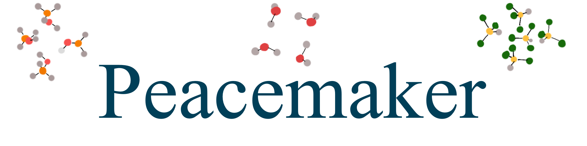

Peacemaker 4 - Documentation
=============================

Peacemaker uses the laws of statistical thermodynamics to calculate the thermodynamic properties 
of pure liquids and liquid mixtures.
It is based on the **Q**\uantum **C**\luster **E**\quilibrium (**QCE**) theory, which is the idea, that 
the liquid bulk system can be described as a dense distribution of statistically reoccurring
molecular cluster motifs. 

.. toctree::
   :maxdepth: 3
   :caption: What is Peacemaker?

   01_peacemaker

.. toctree::
   :maxdepth: 3
   :caption: Compiling and Running

   02_compiling_and_running

.. toctree::
   :maxdepth: 3
   :caption: Configuration files

   03_configuration_files

.. toctree::
   :maxdepth: 3
   :caption: Output files

   04_output

.. toctree::
   :maxdepth: 3
   :caption: Sampling

   05_sampling
